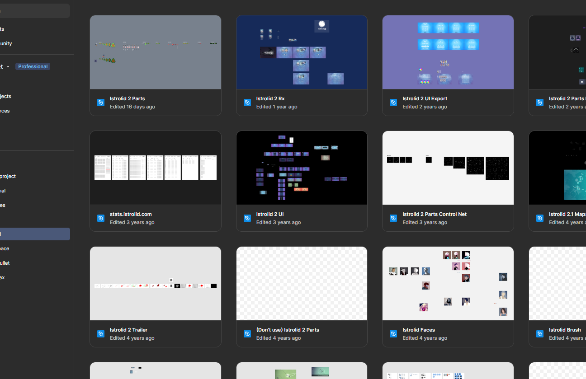
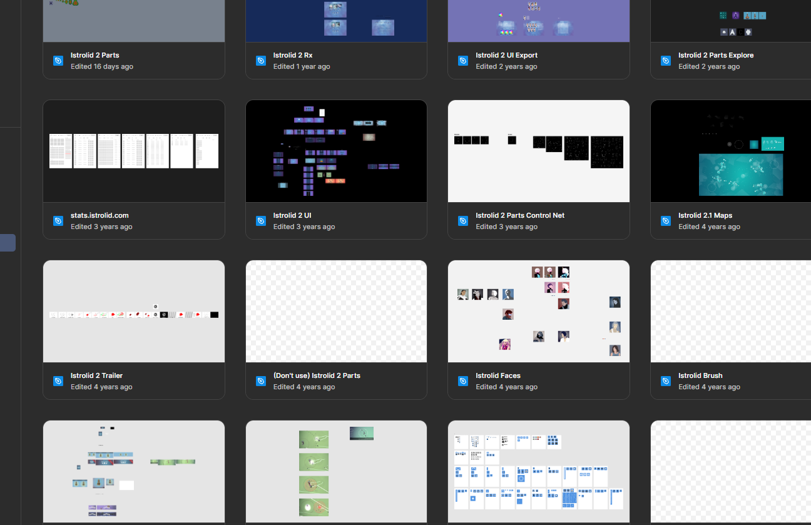
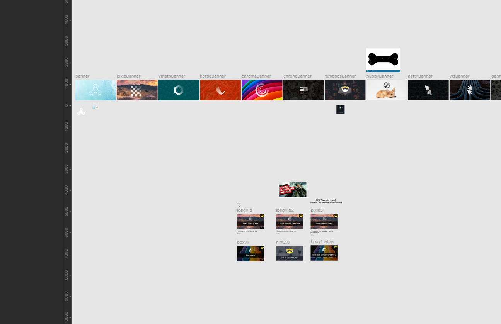
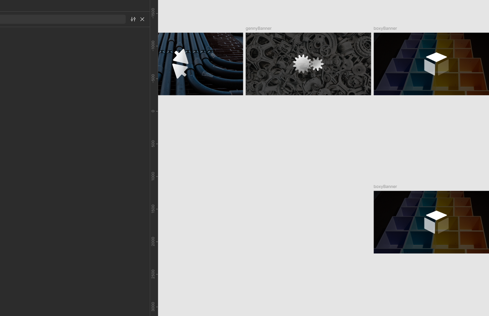
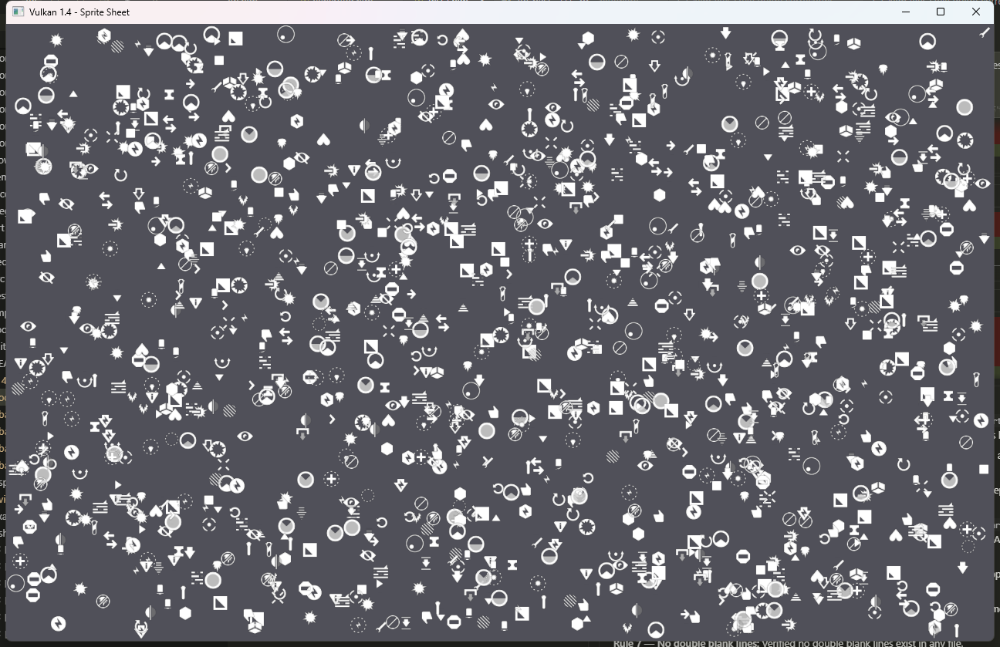
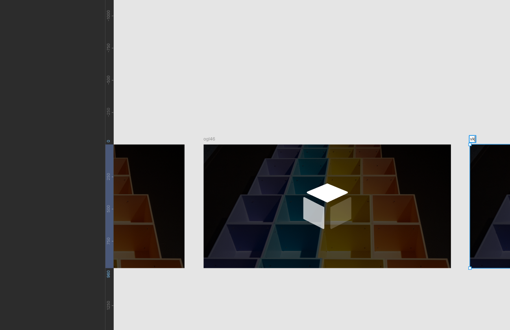

# vk14 - Vulkan 1.4 wrapper for Nim.

`nimby install vk14`


[API reference](https://treeform.github.io/vk14)

## About

Auto-generated Vulkan 1.4 bindings for Nim. Downloads the official Khronos
`vk.xml` registry and generates typed Nim bindings with a modular file layout.
Includes a high-level context helper and six working examples.

> **AI disclaimer: Much of this library was AI generated.**

## Examples

| Example | What it tests |
|---------|--------------|
| [`basic_screen`](examples/basic_screen.nim) | Device init, swap chain, clear color, present |
| [`basic_triangle`](examples/basic_triangle.nim) | Vertex buffers, shader modules, graphics pipeline, draw calls |
| [`basic_quad`](examples/basic_quad.nim) | Texture loading, descriptor sets, sampler, image upload |
| [`basic_cube`](examples/basic_cube.nim) | 3D transforms, depth buffer, MSAA, push constants, mip-mapped textures |
| [`sprite_sheet`](examples/sprite_sheet.nim) | Sprite batching, dynamic vertex buffers, texture atlas |
| [`viewer_obj`](examples/viewer_obj.nim) | OBJ model loading, smooth normals, orbit camera, lighting shaders |

### `basic_screen`

[](examples/basic_screen.nim)

### `basic_triangle`

[](examples/basic_triangle.nim)

### `basic_quad`

[](examples/basic_quad.nim)

### `basic_cube`

[](examples/basic_cube.nim)

### `sprite_sheet`

[](examples/sprite_sheet.nim)

### `viewer_obj`

[](examples/viewer_obj.nim)

## Regenerating bindings

```bash
nim r -d:ssl tools/download_xml.nim
nim r tools/generate_api.nim
```
